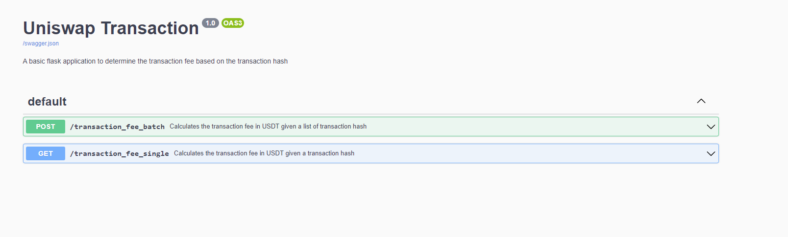

# uniswap_transaction
## Project Introduction
This project aims to build a simple application to track the transaction fee assocaited with a UniSwap Transaction.

## Tech Stack
This project is built with the following:
- Python 3.12.3
- Flask
- SwaggerUI


## Project Directory
```
.
├── README.md
├── app.py
├── docs
│   └── swagger.json 
├── requirements.txt
├── server
│   ├── binance.py
│   └── etherscan.py
└── tests
    └── test_etherscan.py

```
- `README.md`: Markdown file briefly explaining the project
- `Dockerfile`: Dockerfile for dockerization
- `compose.yaml`: Used for docker compose
- `app.py`: Where the main code is executed
- `docs/swagger.json`: Our Interface file describing our HTTP Rest APIs
- `requirements.txt`: Used for docker compose
- `server/`: Contains bulk of the processing code used when calling downstream ETH or Binance APIs
- `tests/`: Folder contains our test files

## Project Setup

1. Clone the project
```
git clone 
```
2. In the project directory, create a `.env` file with the following content:
```
ETHERSCAN_API_KEY = <api_key>
```
This allows you to access the EtherScan's API.

3. To run the application, ensure docker compose is installed. Then run the following:
```
docker compose build
docker compose up
```
4. Access the api testing locally via:
```
http://localhost:5000/swagger/
```
I have configured the app to run on port 5000, so this should work.
The site should look something like this. This is based off Swagger UI and we can test our APIs here.


## Testing
Ensure that the project setup is completed beforehand.

Run the following line in your CLI to run tests:

```
python3 -m unittest discover tests/
```
